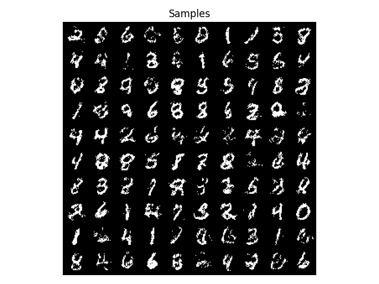

# MADE
Python implementation of the [Masked Autoencoder for Distribution Estimation](https://arxiv.org/abs/1502.03509) paper.
## Architecture
Estimating the probability of an input x as a product of its nested conditionals by masking connections such that each output is connected solely to its preceding inputs.  


## Run 
```
python3 AutoRegressive/MADE/mnist_train.py
```

add ```--binarize``` for binarized MNIST

## Results
### Binarized MNIST



