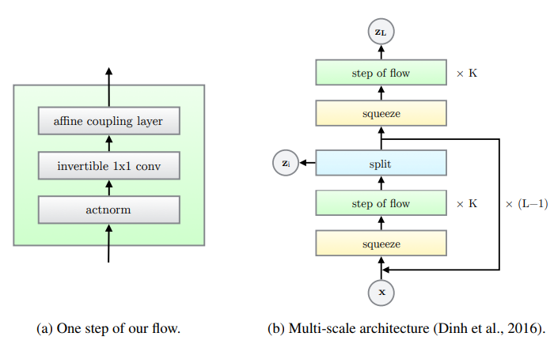
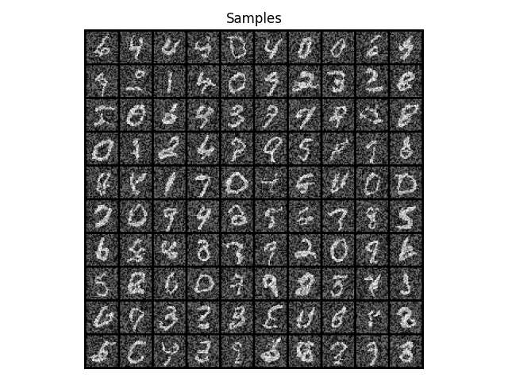

# Glow
This implementation is based on [Chris Chute's implementation](https://github.com/chrischute/glow) 

## Architecture
Glow builds upon NICE and Real-NVP [1][2] and combines a series of K steps per scale in a multi-scale architecture.
Each step consists of an ActNorm layer, an invertible 1x1 convulution, and an affine coupling layer.
#### Act Norm
Similiar to batch normalization, an affine transformation of the activations using a scale and bias parameter per channel is performed. These parameters are initialized such that the post-actnorm activation will have zero mean and unit variance given an initial minibatch. After initialization the parameters are treated as data independent regular learned parameters.  

#### Invertible 1x1 Convolution
A replacement to Real-NVP's fixed permutations.

## Results

## References
1) Laurent Dinh, Jascha Sohl-Dickstein, and Samy Bengio. Density estimation using real nvp, 2017 [arXiv:1605.08803](https://arxiv.org/abs/1605.08803)    
2) Laurent Dinh, David Krueger, and Yoshua Bengio. Nice: Non-linear independent components estimation, 2015. [arXiv:1410.8516](https://arxiv.org/abs/1410.8516)  
3) Diederik P. Kingma and Prafulla Dhariwal. Glow: Generative flow with invertible 1x1convolutions, 2018 [arXiv:1807.03039](https://arxiv.org/abs/1807.03039)  
