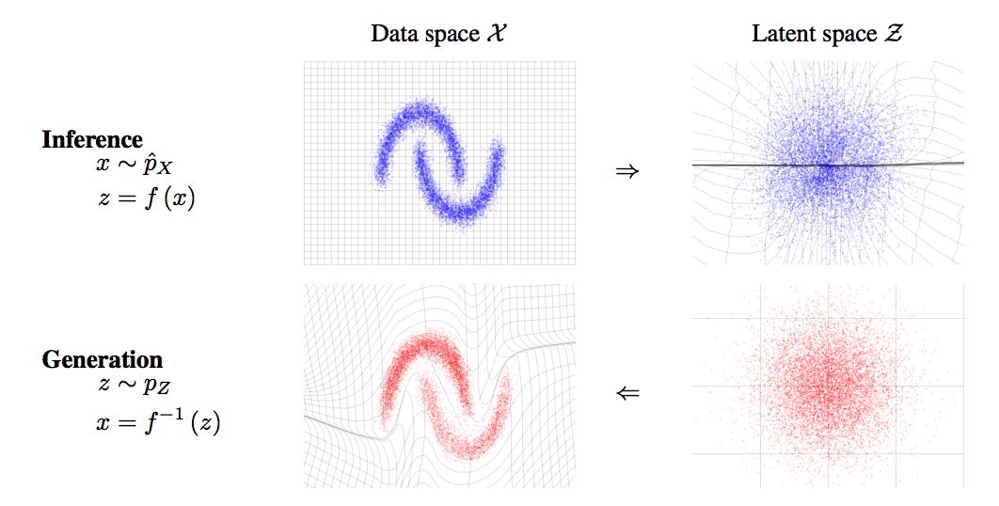
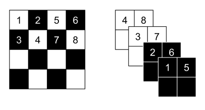
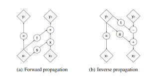

# RealNVP
This implementation is based on [Chris Chute's implementation](https://github.com/chrischute/real-nvp) and [Homework 2 solutions in UC Berkeley's deep unsupervised class](https://sites.google.com/view/berkeley-cs294-158-sp20/home).  

## Architecture
RealNVP (real-valued non-volume preserving transformations) that maps the input distribution p(x) to a latent distribution p(z) through a bijective function f.  
  
The model utilizes the fact that the determinant of a triangular matrix is the product of its diagonal elements by stacking a sequence of simple bijections (affine coupling layers) such that the transformation's jacobian is traingular. 
In affine coupling layers part of the input is updated with a simple invertible function but can be dependent on the remainder in a complex way (deep convolutional networks). The invertible transformation is scaling with an addition of an offest.  
  
To alternate which parts are used for what in the affine coupling layers, checkerboard and channel-wise spatial partitioning are used.
  

## References
1) Laurent Dinh, Jascha Sohl-Dickstein, and Samy Bengio. Density estimation using real nvp, 2017 [arXiv:1605.08803](https://arxiv.org/abs/1605.08803)  
