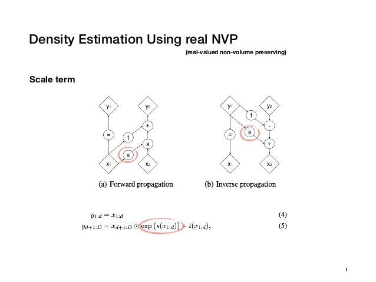

# RealNVP
This implementation is based on [Chris Chute's implementation](https://github.com/chrischute/real-nvp) and [Homework 2 solutions in UC Berkeley's deep unsupervised class](https://sites.google.com/view/berkeley-cs294-158-sp20/home).  

## Architecture
RealNVP (real-valued non-volume preserving transformations) map the input distribution p(x) to a latent distribution p(z) through a bijective function f.  
  
The model utilizes the fact that the determinant of a triangular matrix is the product of its diagonal elements by stacking a sequence of simple bijections (affine coupling layers) such that the transformation's jacobian is triangular. 
In affine coupling layers part of the input is updated with a simple invertible function dependent on the remainder part in a complex way (deep convolutional networks). 
  
To alternate between unchanged parts in the affine coupling layers, checkerboard and channel-wise spatial partitioning are used.  
  

This implementation consists of a multi-scale architecture while half of the dimensions are factored out in regular intervals to avoid high computational and memory costs.

## Results

## References
1) Laurent Dinh, Jascha Sohl-Dickstein, and Samy Bengio. Density estimation using real nvp, 2017 [arXiv:1605.08803](https://arxiv.org/abs/1605.08803)  
