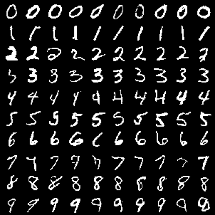

# GATED PIXEL CNN
Python implementation of the GatedPixelCNN model in pytorch. This implementation is based on [Mark Zakharov's impelemtation](https://github.com/anordertoreclaim/PixelCNN), [Homework 2 solutions in UC Berkeley's deep unsupervised class](https://sites.google.com/view/berkeley-cs294-158-sp20/home), and [Generating Intepretable Images with Controlable Structure by Reed and al., 2016](http://www.scottreed.info/files/iclr2017.pdf)

## Architecture
The Pixel CNN [1] is an autoregressive model that generates pixels sequentially in a raster scan order such that each pixel
is dependent on the previously generated pixels. This is achieved via masked convolutions, in which the convolutional weights are multiplied with a binary mask such that each pixel can only receive information from the previously generated pixels. In mask A, the current pixel is not seen, while it is seen in mask B.

The Pixel CNN model suffers from a blind spot  
  
The GatedPixelCNN [2] removes the blind spot, replaces the relu activation unit with gated blocks, and adds conditioning on class labels adding information of what is supposed to in the image.

A detailed explanation can be found in [Sergei Turukin's blog](https://sergeiturukin.com/2017/02/24/gated-pixelcnn.html).

## Results
### Binary MNIST with class label conditioning

### Colored MNIST - color values in [0, 3]

## References
1) Aaron van den Oord, Nal Kalchbrenner, and Koray Kavukcuoglu.  Pixel recurrent neural networks, 2016 [arXiv:1601.06759 ](https://arxiv.org/abs/1601.06759)  
2) Aaron van den Oord, Nal Kalchbrenner, Oriol Vinyals, Lasse Espeholt, Alex Graves, andKoray Kavukcuoglu.  Conditional image generation with pixelcnn decoders, 2016. [arXiv:1606.05328](https://arxiv.org/abs/1606.05328)  
3) S. Reed, A. van den Oord, N. Kalchbrenner, V. Bapst,M. Botvinick, and N. de Freitas. Generating interpretable images with controllable structure. Technical report, Techni-cal report, 2016. 2, 2016 [http://www.scottreed.info/files/iclr2017.pdf](http://www.scottreed.info/files/iclr2017.pdf)  
