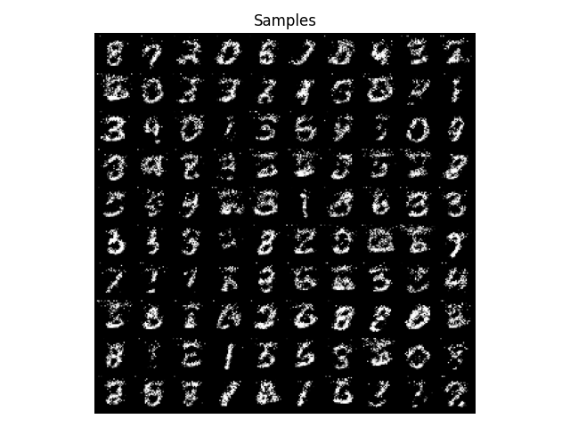
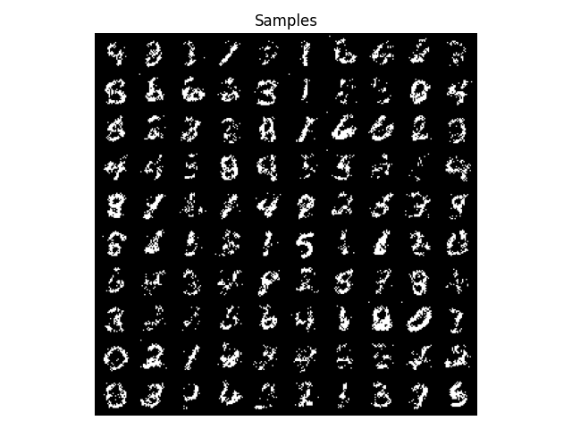

# MADE
Python implementation of the [Masked Autoencoder for Distribution Estimation](https://arxiv.org/abs/1502.03509) paper.
## Idea
Estimating the probability of an input x as a product of its nested conditionals  
  
This is achieved by masking connections such that each output is connected solely to its preceding inputs.

## Results
### MNIST

### Binarized MNIST

